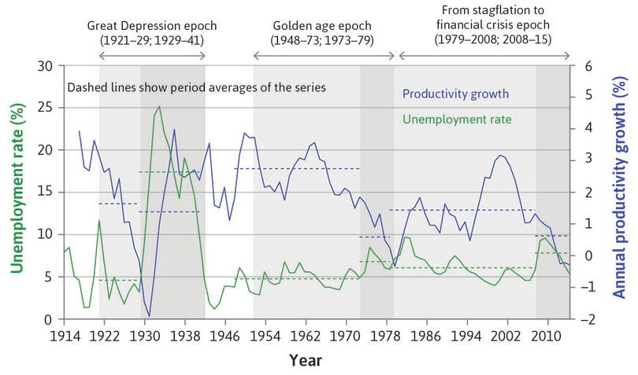
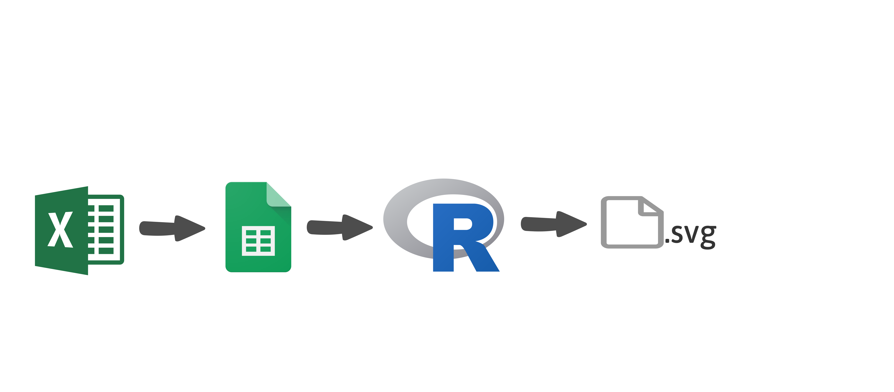
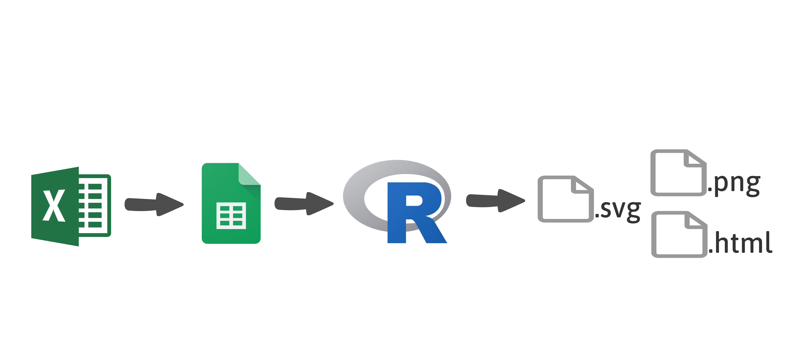
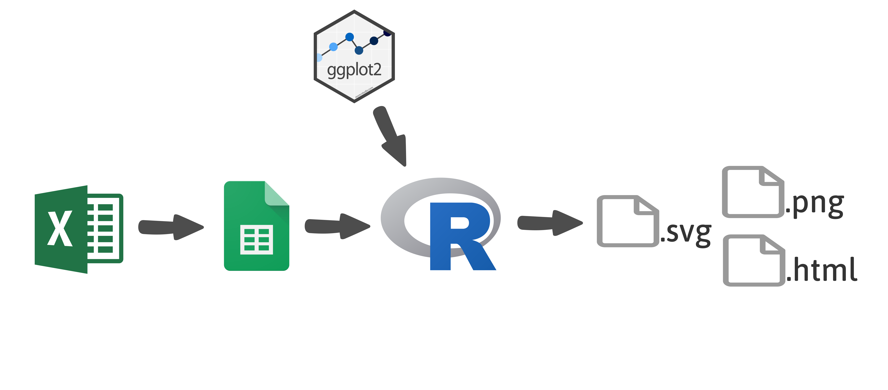
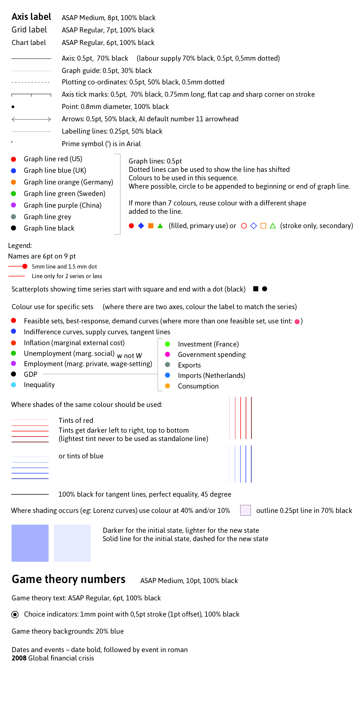
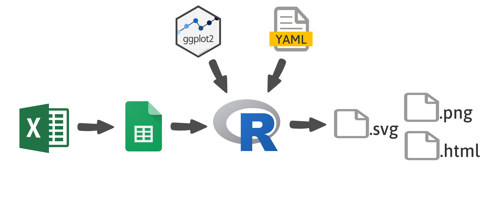
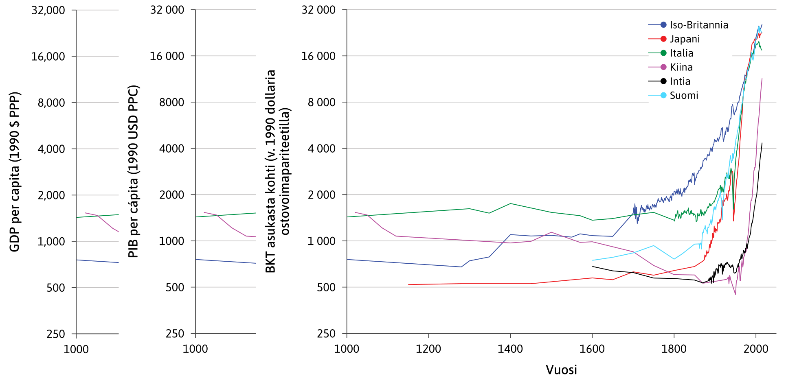

background-image: url("figs/lecture.jpg")
background-size: cover

```{r xaringan-themer, include=FALSE}
library(xaringanthemer)
style_duo_accent(
  primary_color = "#424242",        # blue
  secondary_color = "#fe7642",      # orange
  header_font_google = google_font("Asap Medium"),
  text_font_google = google_font("Asap"),
  header_h1_font_size = "2.5rem",
  header_h2_font_size = "2rem"
)
```

```{r setup, include=FALSE}
options(htmltools.dir.version = FALSE)
```

```{css echo=FALSE}
.remark-slide-number {
  display: none;
}
```
???

Image credit: [Unsplash](https://unsplash.com/photos/46M6QPE5MTY)

---
background-image: url("figs/lecture.jpg")
background-size: cover
class: center, middle

<center></center>

???

Image credit: [CORE Economics Education](https://www.core-econ.org/)

---
background-image: url("figs/globe.jpg")
background-size: cover
class: center, middle

???

Image credit: [Unsplash](https://unsplash.com/photos/WZh1QZFB4kc)
---
background-image: url("figs/globe_circle.png")
background-size: cover

# .white[title title title title title]
## .white[Megan Beckett]
### .white[Data Scientist]

???

Image credit: [Unsplash](https://unsplash.com/photos/WZh1QZFB4kc)

---
background-image: url("figs/graphs.png")
background-size: cover

---
background-image: url("figs/graphs_faded.png")
background-size: cover
class: center, middle

# "Can you automate this?"

---
# Step 1: Automation



---
# Step 1: Automation



---
background-image: url("figs/graphs_faded.png")
background-size: cover
class: center, middle

# "Mmm, can you make them look as good?"

---
# Step 2: Aesthetics


---
# 80% there with ggplot theme
.left-column[

]
--
.right-column[
```{r eval=FALSE}
theme_core <- function(...) {
    theme_classic(
      base_family = "Asap"
    ) +
    theme(
      # Text 
      axis.title = element_text(size = 20, family = "Asap Medium"),
      # Line colours
      axis.ticks = element_line(colour = "#464646"),
      # Area colours
      legend.background = element_rect(fill = alpha('white', 0.0)),
      # Spacing and markdown
      axis.title.x = ggtext::element_markdown(margin = margin(15))
    ) +
    theme(
      ...
    )
}
```

]
---
# Custom key glyphs 

TODO

- picture and code
---

# Original vs (aesthetically) automated

TODO

- pictures
- how many?
---
background-image: url("figs/graphs_faded.png")
background-size: cover
class: center, middle

# "Ok, can you do this in all languages?"

---
# Step 3: Translation

---
# Different numbering systems


---
# Different numbering systems

TODO

- picture and code examples
---
background-image: url("figs/graphs_faded.png")
background-size: cover
class: center, middle

# "Let's do this!"

---
background-image: url("figs/toolshed.jpg")
background-size: cover

???

Image credit: [Unsplash](https://unsplash.com/photos/qAHdDVN0gMQ)
---
background-image: url("figs/tools.png")
background-size: cover

???

Image credit: [Unsplash](https://unsplash.com/photos/qAHdDVN0gMQ)

---
background-image: url("figs/tools_2.png")
background-size: cover

???

Image credit: [Unsplash](https://unsplash.com/photos/qAHdDVN0gMQ)
<!-- --- -->
<!-- background-image: url("figs/hands.jpg") -->
<!-- background-size: cover -->

<!-- ??? -->

<!-- Image credit: [Unsplash](https://unsplash.com/photos/wKAKZV8Ewkk) -->

---
background-image: url("figs/lecture.jpg")
background-size: cover
class: center, middle

---
background-image: url("figs/globe.jpg")
background-size: cover
class: center

# .white[Thank you!]
### .white[@mbeckett_za]
### .white[megan@exegetic.biz]