background-image: url("figs/lecture.jpg")
background-size: cover

```{r xaringan-themer, include=FALSE}
library(xaringanthemer)
style_duo_accent(
  primary_color = "#424242",        # blue
  secondary_color = "#fe7642",      # orange
  header_font_google = google_font("Asap Medium"),
  text_font_google = google_font("Asap"),
  header_h1_font_size = "2.5rem",
  header_h2_font_size = "2rem"
)
```

```{r setup, include=FALSE}
options(htmltools.dir.version = FALSE)
```

```{css echo=FALSE}
.remark-slide-number {
  display: none;
}
```
???

Image credit: [Unsplash](https://unsplash.com/photos/46M6QPE5MTY)

---
background-image: url("figs/lecture.jpg")
background-size: cover
class: center, middle

<center></center>

???

Image credit: [CORE Economics Education](https://www.core-econ.org/)

---
background-image: url("figs/lecture.jpg")
background-size: cover
class: center, middle

<center>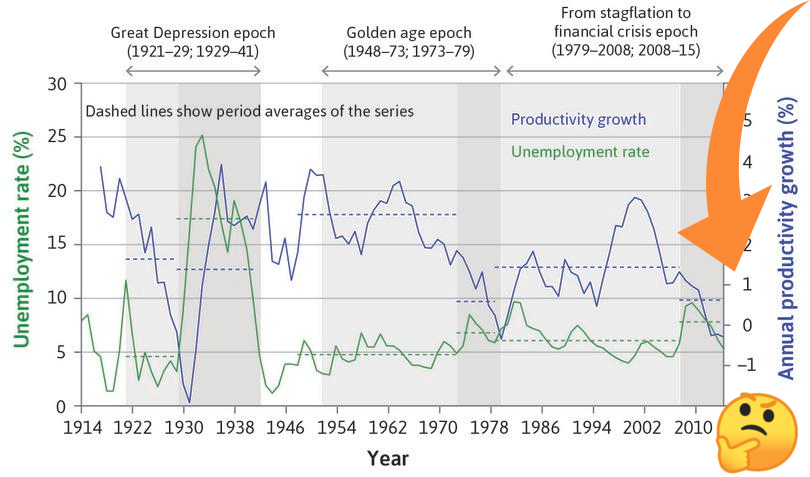</center>

???

Image credit: [CORE Economics Education](https://www.core-econ.org/)

---
background-image: url("figs/globe.jpg")
background-size: cover
class: center, middle

???

Image credit: [Unsplash](https://unsplash.com/photos/WZh1QZFB4kc)
---
background-image: url("figs/globe_circle.png")
background-size: cover

# .white[title title title title title]
## .white[Megan Beckett]
### .white[Data Scientist]

???

Image credit: [Unsplash](https://unsplash.com/photos/WZh1QZFB4kc)

---
background-image: url("figs/graphs.png")
background-size: cover

---
background-image: url("figs/graphs_faded.png")
background-size: cover
class: center, middle

# "Can you automate this?"

---
# Step 1: Automation


---
# Step 1: Automation


---
background-image: url("figs/graphs_faded.png")
background-size: cover
class: center, middle

# "Mmm, can you make them look as good?"

---
# Step 2: Aesthetics


---
# 80% there with ggplot theme
.left-column[
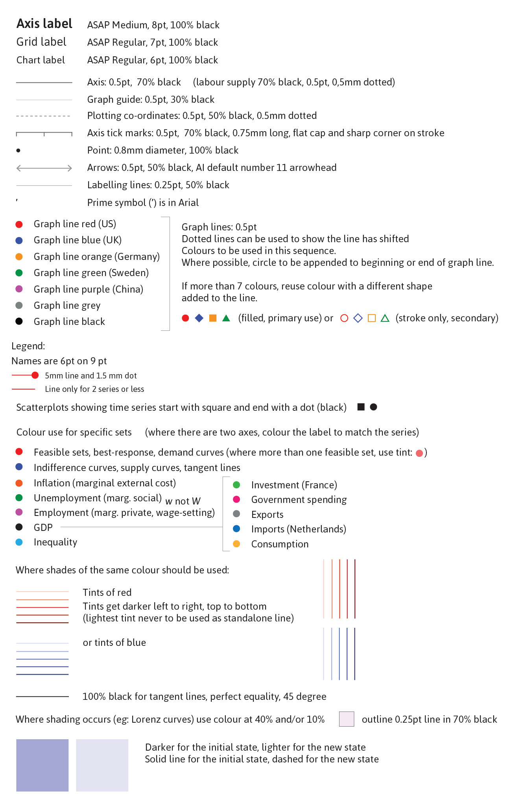
]
--
.right-column[
```{r eval=FALSE}
theme_core <- function(...) {
    theme_classic(
      base_family = "Asap"
    ) +
    theme(
      # Text 
      axis.title = element_text(size = 20, family = "Asap Medium"),
      # Line colours
      axis.ticks = element_line(colour = "#464646"),
      # Area colours
      legend.background = element_rect(fill = alpha('white', 0.0)),
      # Spacing and markdown
      axis.title = ggtext::element_markdown(margin = margin(15))
    ) +
    theme(
      ...
    )
}
```

]
---
<center>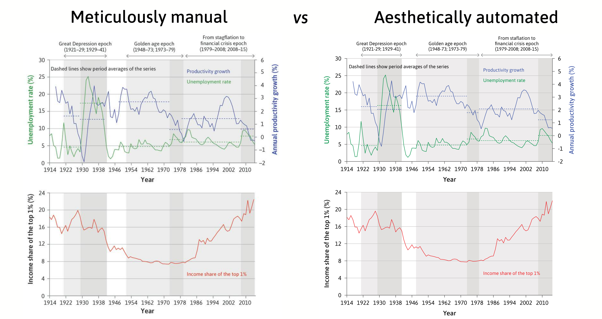</center>
### Spot the differences! See any? Tweet me *@mbeckett_za* 

---
<center>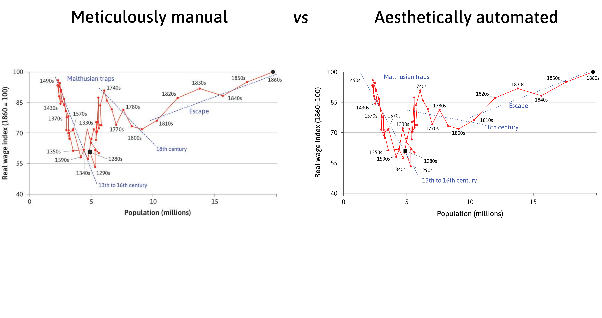</center>
### Spot the differences! See any? Tweet me *@mbeckett_za* 

---
<center></center>
### Spot the differences! See any? Tweet me *@mbeckett_za* 

---
background-image: url("figs/graphs_faded.png")
background-size: cover
class: center, middle

# "Ok, can you do this in all languages?"

---
# Step 3: Translation

---
# YAML
.pull-left[

]
.pull-right[

### *Yet Another Markup Language*
### *YAML Ain't Markup Language*
]
---
# YAML
.pull-left[

]
.pull-right[

```{r eval = FALSE}
library(yaml)

# Translation strings
strings <- read_yaml("file_name.yml")
```
]

---
# YAML
.pull-left[

]
.pull-right[

```{r eval = FALSE}
library(yaml)

# Translation strings
strings <- read_yaml("file_name.yml")
```

```{r eval = FALSE}
ggplot(data, aes(x = year, y = temp)) +
  geom_line() +
  labs(x = X_AXIS_LABEL,
       y = Y_AXIS_LABEL)
```
]

---
# YAML
.pull-left[

]
.pull-right[

```{r eval = FALSE}
library(yaml)

# Translation strings
strings <- read_yaml("file_name.yml")
```

```{r eval = FALSE}
ggplot(data, 
       aes(x = year, y = temp)) +
  geom_line() +
  labs(x = X_AXIS_LABEL,
       y = Y_AXIS_LABEL)
```

```{r eval=FALSE}
theme(axis.title = ggtext::element_markdown()) 
```

]

---
# YAML
.pull-left[

]
.pull-right[

```{r eval = FALSE}
library(yaml)

# Translation strings
strings <- read_yaml("file_name.yml")
```

```{r eval = FALSE}
ggplot(data, 
       aes(x = year, y = temp)) +
  geom_line() +
  labs(x = X_AXIS_LABEL,
       y = Y_AXIS_LABEL)
```

```{r eval=FALSE}
theme(axis.title = ggtext::element_markdown()) 
```

```{r eval=FALSE}
geom_text <- function(...) {
  ggtext::geom_richtext(...)
}
```

]

---
# Different numbering systems

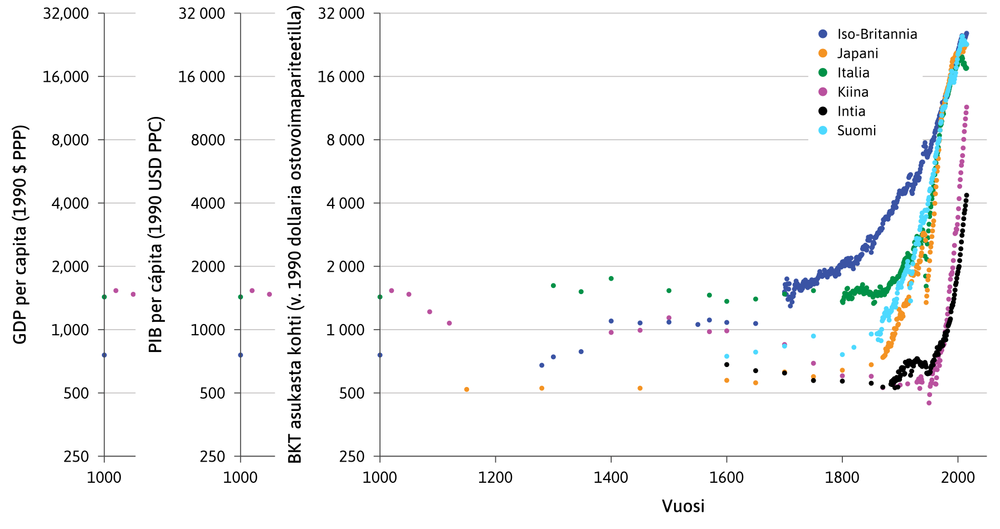

---
# Different numbering systems

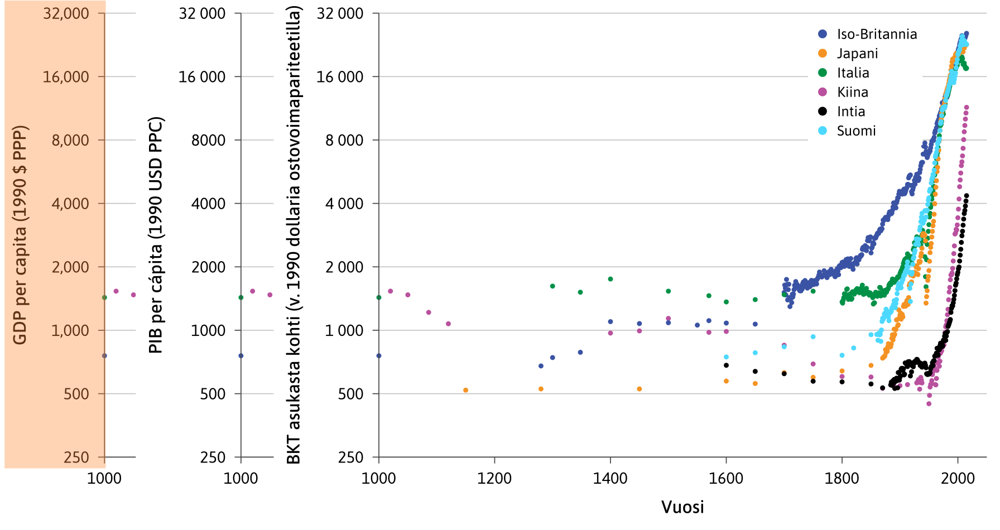

---
# Different numbering systems

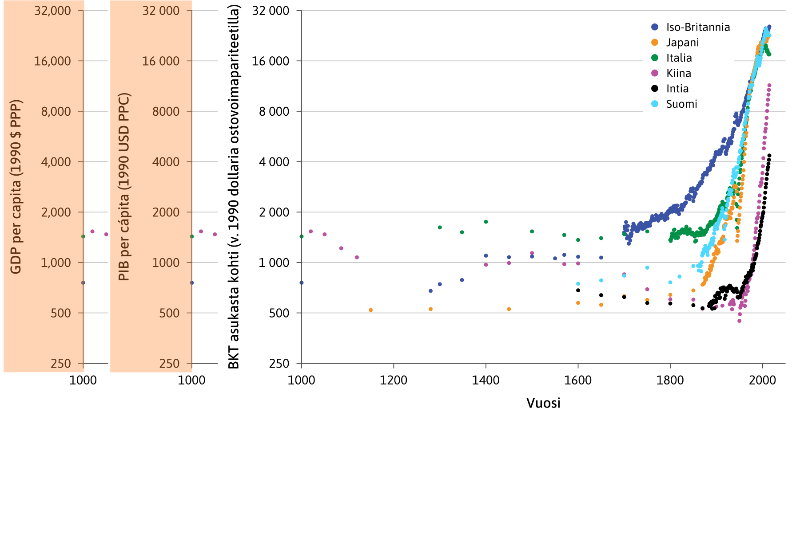

---
# Different numbering systems

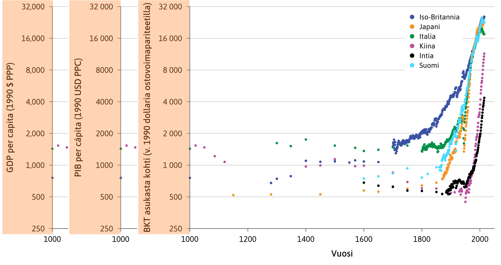

---
# Different numbering systems

.pull-left[
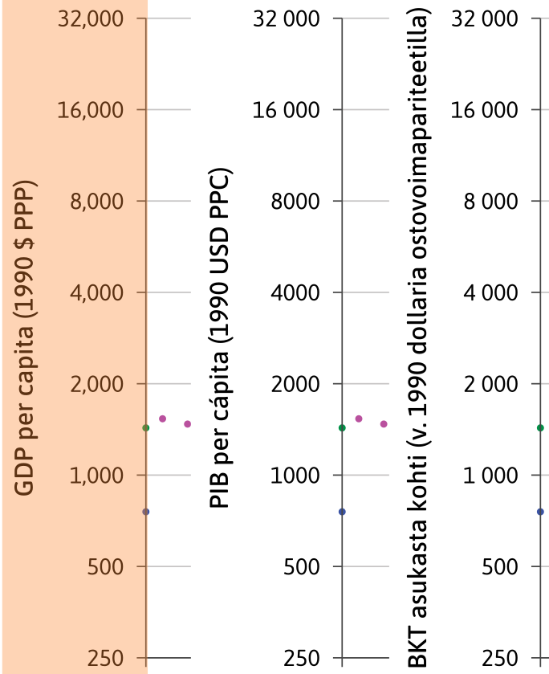
]
.pull-right[

### A number formatting function per language
```{r eval=FALSE}
# English
en <- function(x){
  number_format(accuracy = decimal_acc(x),
               scale = 1,
               big.mark = ",",
               decimal.mark = ".")(x)
}
```
]
---
# Different numbering systems

.pull-left[
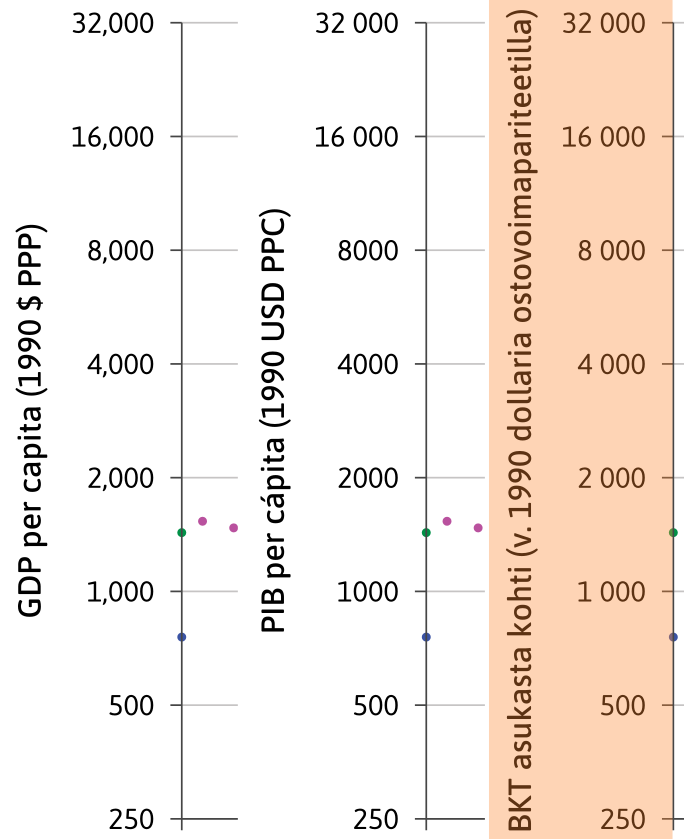
]
.pull-right[

### A number formatting function per language

```{r eval=FALSE}
# Finnish
fi <- function(x){
  number_format(accuracy = decimal_acc(x),
                scale = 1,
                big.mark = " ",
                decimal.mark = ",")(x)
}
```

]
---
# Different numbering systems

.pull-left[
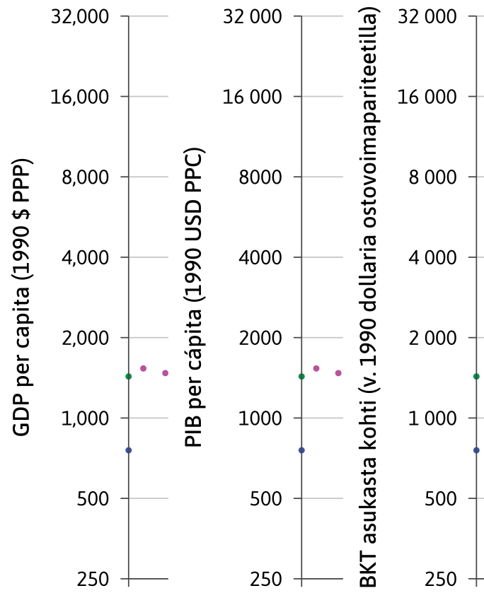
]
.pull-right[

### Function supplied to labels argument using `match.fun()`

```{r eval = FALSE}
for (LANG in LANGUAGES) {
  
  ...
  
   ggplot(data, 
        aes(x = year, 
            y = gdp)) +
    scale_y_continuous(
      labels = match.fun(LANG)
      )
}

```

]
---
background-image: url("figs/graphs_faded.png")
background-size: cover
class: center, middle

# "Let's do this!"

---
background-image: url("figs/toolshed.jpg")
background-size: cover

???

Image credit: [Unsplash](https://unsplash.com/photos/qAHdDVN0gMQ)
---
background-image: url("figs/tools.png")
background-size: cover

???

Image credit: [Unsplash](https://unsplash.com/photos/qAHdDVN0gMQ)

---
background-image: url("figs/tools_2.png")
background-size: cover

???

Image credit: [Unsplash](https://unsplash.com/photos/qAHdDVN0gMQ)
---
background-image: url("figs/globe.jpg")
background-size: cover
class: center, middle

???

Image credit: [Unsplash](https://unsplash.com/photos/WZh1QZFB4kc)
---
background-image: url("figs/globe.jpg")
background-size: cover
class: center

# .white[Thank you!]
### .white[@mbeckett_za]
### .white[megan@exegetic.biz]

---
# Custom key glyphs 
