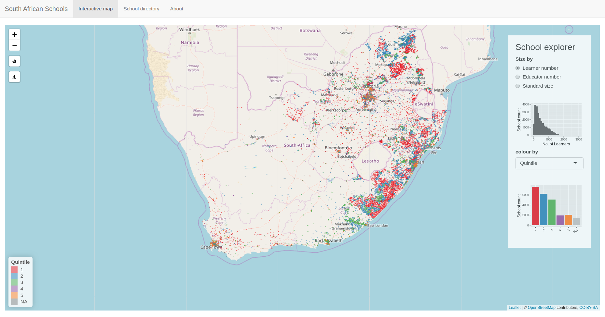

# satRday 2019 - Joahnnesburg

## Exploring the SA Schools directory with R

A talk on the Shiny App I built to geocode and map out the schools master list of data from the Department of Basic Education.

[Video of talk](https://www.youtube.com/watch?v=tMGZ_cppP5o&list=PLyPse8KhWpDP5fdkP82mB5vwCxWG-dMaT&index=4&t=7s)

> South Africa has an incredibly diverse, expansive education system, with over 25 000 schools dotted across the country, ranging from dilapidated mud huts and blackboards underneath trees to state-of-the-art, high tech facilities. 
>
> As a country, we partake in many assessments and research projects, both local and international, constantly collecting data to inform policy, striving to find ways to improve the education system.
>
> I wanted to see how I could add value by taking some seemingly forgotten Excel files from the Department of Basic Education website, and providing a visual map to explore, understand and appreciate the diversity and complexity of our education system.
>
> In this talk, I’ll show how I used OpenStreetMaps to help geocode missing data for school locations (and overcame some unique challenges!), literally helping to put them on the map. Then, I’ll show how I used Shiny and Leaflet to create an app which allows anybody, from members of the public to NGO teams to education officials, to visually explore, understand and locate schools across our country, without having to delve into those enormous Excel files.
>
> By the end, not only will you get an idea of how easy it is to turn legacy geospatial data into something visual, interactive and informative, but you’ll also have a unique perspective into the challenges posed by South Africa’s multifarious, multilayered, multicultural and multicoloured education system.

### Resources
- [Github repo](https://github.com/MeganBeckett/sa_schools) for the Shiny App