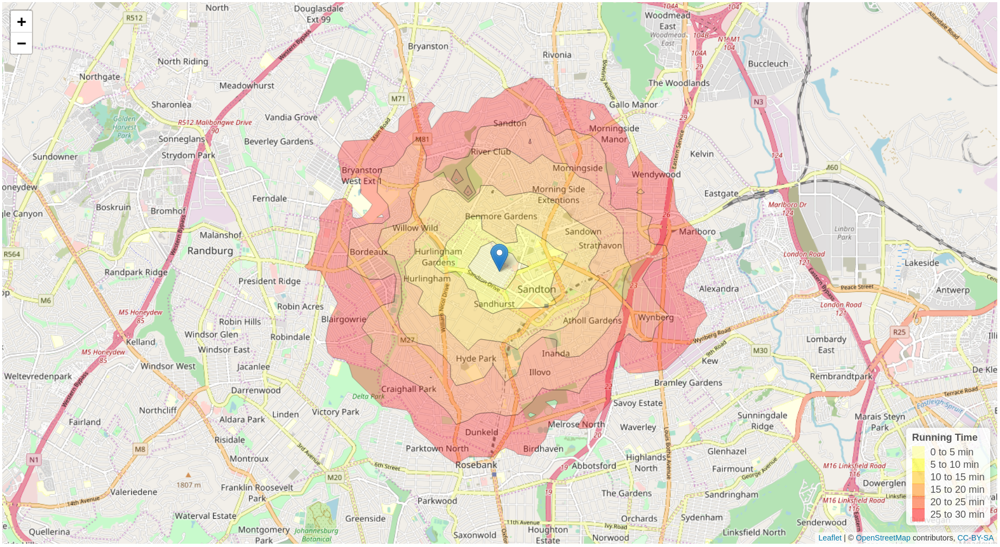

# satRday 2020 - Joahnnesburg

## Running in circles with OSRM and R

[Notebook](https://rpubs.com/mbeckett/running-in-circles) illustrating the key topics from the talk.

**Two key questions to answer:**

*With my running shows on...*

### 1. What is the optimal route to visit the parks in the surround area of our BnB in Joburg?

### 2. What can I possibly see within certain time intervals?

### Resources
- [Slides]() - still coming.
- [Notebook](https://rpubs.com/mbeckett/running-in-circles) illustrating the key topics from the talk.
- A gist for the install recipe for a local instance of OSRM (from @datawookie): https://gist.github.com/MeganBeckett
- Alternatively, use the Docker image: https://hub.docker.com/r/osrm/osrm-backend/

