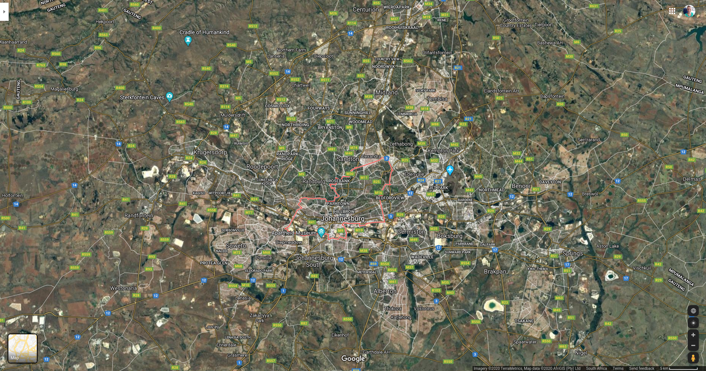

```{r setup, include=FALSE}
options(htmltools.dir.version = FALSE)
knitr::opts_chunk$set(echo = FALSE, warning = FALSE,  message = FALSE, fig.retina = 3)
```

This notebook is in support of my presentation, **"Running in Circles"** at [satRday 2020 Johannesburg](https://joburg2020.satrdays.org/). Slides are available [here]().

Three (relevant) things about me:

- I like green spaces
- I like R
- I like to run

<center></center>

This notebook focuses on two functions in the `{osrm}` package, namely:

- `osrmTrip()` - Get the travel geometry between multiple unordered points.
- `osrmIsochrone()` - Get polygons of isochrones.

The other main functions in the R package are:

- `osrmTable()` - Get travel time matrices between points.
- `osrmRoute()` - Get the shortest path between two points.

Each of the functions acts as an interface to build and send an OSRM API query to the specific OSRM services.

<center></center>

## Set up

Instructions for building and running a local osrm instance are [here](https://datawookie.netlify.com/blog/2017/09/building-a-local-osrm-instance/).

Connect to the OSRM server that you have running locally. 

In this example, I downloaded, extracted and created the hierarchichal data for **Johannesburg, South Africa** using a custom *running* profile that I created. This was a modification of the default `foot.lua` profile provided by OSRM. The key adjustment was the average "walking speed", which I changed to to 5 minutes/km (or 12 km/hour).

The profile that you use to extract and create the OSRM data is very important, depending on your use case. The defualt profiles provided are:

- foot
- car
- bicycle

Each profile (coded in the `Lua` language) provides specifications and constraints typical of the mode of transport, including average speeds and which roads, paths or tracks are allowed as part of a route.


```{r echo = FALSE}
# LIBRARIES
library(osrm)
library(leaflet)
library(tidyverse)

# OSRM SERVER
 options(osrm.server = "http://127.0.0.1:5000/")
```


Next, we will investigate two key questions with our OSRM set up.

## 1. Optimal route

**What's the *optimal route* to visit the parks in the surrounding area?**

My version of a "Travelling salesman problem", here we are going to find the optimal route between the parks in the surrounding area of my BnB I am staying at in Joburg for satRday. We are going to be using a running profile to get estimated running distances and times for the round trip.

### Get the locations
```{r}
# LOCATIONS
# Create a dataframe of locations of the parks
# These are unordered - OSRM will determine the optimal order for the shortest route
locs <- data.frame(id = c("bnb", "james_ethel_park", "jhb_botanical_gardens", "innesfree_park",
                          "zoo_lake_park", "delta_park", "riverside_park", "george_lea_park", "victoria_park"),
                   lon = c(28.045374, 28.062958, 27.998316, 28.075012,
                           28.032836, 28.009244, 28.022098, 28.034806, 28.010344),
                   lat = c(-26.100931, -26.137748, -26.159879, -26.104533, 
                           -26.161458, -26.125630, -26.101475, -26.099673, -26.137917)
                   )
```

### Calculate the optimal trip

```{r}
# TRIP
# Calculate the shortest round trip between the park locations
trip <- osrmTrip(locs)
```

### Visualise

```{r}
# Get the spatial lines dataframe 
trip_sp <- trip[[1]]$trip

# PLOT WITH LEAFLET
leaflet(data = trip_sp) %>% 
  setView(lng = 28.039596, lat = -26.128778, zoom = 13) %>%
  addTiles() %>% 
  addMarkers(lng = locs$lon, lat = locs$lat, popup = locs$id) %>%
  addPolylines()
```

### Summary of each leg
```{r}
leg_summary <- trip_sp@data %>%
  mutate(duration = round(duration, 1),
         distance = round(distance, 1))

leg_summary
```

### Overal trip summary

A distance of 33 km and estimated time of 165 minutes sounds pretty good for a long run visiting the parks of Joburg! 

```{r}
trip_summary <- trip[[1]]$summary
trip_summary
```


## 2. Running isochrones

**What can I possibly see within certain *time intervals?***

Instead of a round trip, we are going to use one central location and generate a series of isochrones, defined by incremental running time intervals, to see what area I could cover in a specific time frame.

*isochrone* = a line connecting points relating to the same travel time.

### Set location

```{r}
# LOCATION
# The central location point that will be used to calculate the isochrones
loc <- c(28.045374, -26.100931)
```

### Generate the isochrones

```{r echo = FALSE}
# ISOCHRONE
# Create series of isochrones in 5 minute increments
iso <- osrmIsochrone(loc, breaks = seq(from = 0, to = 30, by = 5), res = 300)
```

**Note:** The `res` argument is the number of points used to compute the isochrones. It is one side of the square grid, so the total number of points will be res*res. The default is 30 but I normally increase to get more detailed isochrones. The higher the number the longer the computation time as well. You normmaly need to experiment with this and find the optimal number for your use case.

### Visualise

```{r}
# PLOT WITH LEAFLET
# Create factor for colour scale with labels for time intervals
iso@data$run_times <- factor(paste(iso@data$min, "to", iso@data$max, "min"),
                              levels = c("0 to 5 min", "5 to 10 min", "10 to 15 min", "15 to 20 min", "20 to 25 min", "25 to 30 min"))

# Colour palette for each area
factpal <- colorFactor(rev(heat.colors(6)), iso@data$run_times)

# Plot with leaflet
leaflet(data = iso) %>% 
  setView(lng = 28.045374, lat = -26.100931, zoom = 13) %>%
  addTiles() %>% 
  addMarkers(lng = 28.045374, lat = -26.100931, popup = "My BnB") %>%
  addPolygons(fill = TRUE, stroke=TRUE, color = "black",
                                        fillColor = ~factpal(iso@data$run_times),
                                        weight = 0.5, fillOpacity = 0.3,
                                        data = iso, popup = iso@data$run_times,
                                        group = "Running Time") %>% 
                # Legend
                addLegend("bottomright", pal = factpal, values = iso@data$run_times,   title = "Running Time")
  
```

