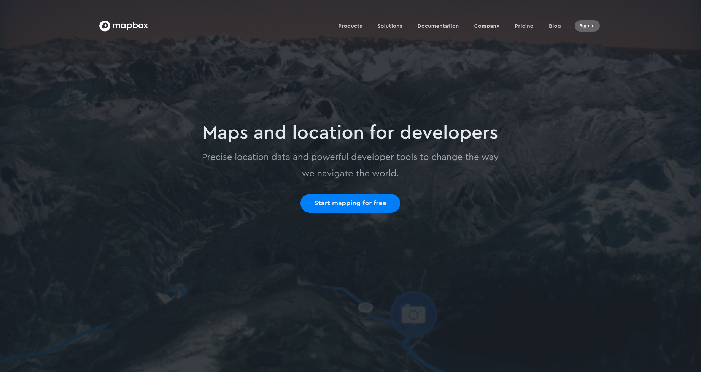
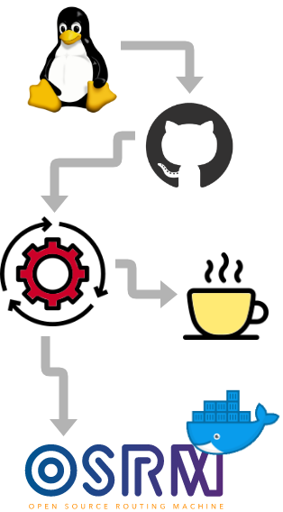

class: inverse, center, middle

# 3 (relevant) things:

```{r setup, include=FALSE}
options(htmltools.dir.version = FALSE)
knitr::opts_chunk$set(echo = TRUE, warning = FALSE,  message = FALSE, fig.retina = 3)

```

---
class: inverse, center, middle

# 3 (relevant) things:
## I like green spaces
---
class: inverse, center, middle

# 3 (relevant) things:
## I like green spaces
## I like R

---
class: inverse, center, middle

# 3 (relevant) things:
## I like green spaces
## I like R
## I like running


---
class: center, middle

<center></center>
---
class: center, middle


---
class: center, middle

<center></center>

---
class: center, middle

<center></center>

---
class: center, middle

<center></center>

---
class: center, middle

<center></center>

---
## Building OSRM
.left-column[

]
.right-column[
```{bash eval = FALSE}
# Necessary infrastructure. 
sudo apt update
sudo apt install -y git cmake build-essential jq htop \
                    liblua5.2-dev libboost-all-dev \
                    libprotobuf-dev libtbb-dev \
                    libstxxl-dev libbz2-dev

# Grab the source on GitHub.
git clone https://github.com/Project-OSRM/osrm-backend.git

# Create a build folder and then run cmake.
cd osrm-backend/
mkdir build
cd build/
cmake ..

# Next initiate the build. 
# This will take some time - grab a cup of coffee!
make

# When the build completes, 
# make the install target for OSRM.
sudo make install
```
]

---
## Getting the data - **www.openstreetmap.org**
<center></center>

---
## Getting the data - **www.openstreetmap.org**

<br>
<br>
<br>
<br>
<br>
<br>
<br>
<br>
<center></center>

---
## Getting the data - **www.openstreetmap.org**
<center></center>

---
## Preparing the data
.pull-left[
### Extract the map
- car
- bike
- foot

```{bash eval=FALSE}
osrm-extract map.xml -p profiles/foot.lua
```
]
.pull-right[

]
---
## Preparing the data
.pull-left[
### Extract the map
- car
- bike
- foot

```{bash eval=FALSE}
osrm-extract map.xml -p profiles/foot.lua
```

### Create the hierarchy

```{bash eval=FALSE}
osrm-contract map.xml.osrm
```
]
.pull-right[

]
---
## Preparing the data
.pull-left[
### Extract the map
- car
- bike
- foot

```{bash eval=FALSE}
osrm-extract map.xml -p profiles/foot.lua
```

### Create the hierarchy

```{bash eval=FALSE}
osrm-contract map.xml.osrm
```
<br>
<br>
## Launch the service

```{bash eval=FALSE}
osrm-routed map.xml.osrm
```
]
.pull-right[

]

---
## How long and far to walk from here to the nearest park?
<center></center>

---
## How long and far to walk from here to the nearest park?

<center></center>

---
## How long and far to walk from here to the nearest park?

```{bash eval=FALSE}
curl "http://127.0.0.1:5000/route/v1/walking/28.053241,-26.113230;28.073497,-26.105388" | jq
```

--
```{r eval=FALSE}
{
  "code": "Ok",
  "waypoints": [
    {
      "hint": "9lAqgBf7LYArAAAAlQAAALwBAABWAQAAPxLCQHeHpEGs9nZCSEgAfw88ZVXO",
      "distance": 2.634498,
      "location": [
        28.053251,
        -26.113252
      ],
      "name": "Discovery Place"  #<<
    },
    {
      "hint": "eNMGgITTBoBfBQAAZAEAAAAAAABIDAAA99A-Q8MARUIAAAAAWBPaQ1",
      "distance": 0.447755,
      "location": [
        28.0735,
        -26.105385
      ],
      "name": "Grayston Drive"  #<<
    }
  ],
```
---
## How long and far to walk from here to the nearest park?

```{bash eval=FALSE}
  "routes": [
    {
      "legs": [
        {
          "steps": [],
          "weight": 1997.1,
          "distance": 2756.8,
          "summary": "",
          "duration": 1997.1
        }
      ],
      "weight_name": "duration",
      "geometry": "xfk~CycfjD_EeNuO}OcCoEoNme@]}@WJ_JiXgAOWiBOMqCVw@UcAbCj@{Bv@_BtMuN",
      "weight": 1997.1,
      "distance": 2756.8, #<<
      "duration": 1997.1  #<<
    }
  ]
}


```

- The `duration` is in seconds.
- The `distance` is in metres. 

---
## The osrm R package

.pull-left[
```{r eval=FALSE}
install.packages('osrm')
```
]

.pull-right[
```{r echo=FALSE}
library(leaflet)
leaflet() %>% 
  setView(lng = 28.045374, lat = -26.100931, zoom = 13) %>% 
  addTiles() %>%
  addMarkers(lng = 28.045374, lat = -26.100931, popup = "Our Bnb")
```
]
---
## The osrm R package

.pull-left[
```{r eval=FALSE}
install.packages('osrm')
```
<br>

### Two important questions:
<br>

**1. What's the *optimal route* to visit the parks in the surrounding area?**

<br>
**2. What can I possibly see within certain *time intervals?***
]

.pull-right[
```{r echo=FALSE}
library(leaflet)
leaflet() %>% 
  setView(lng = 28.045374, lat = -26.100931, zoom = 13) %>% 
  addTiles() %>%
  addMarkers(lng = 28.045374, lat = -26.100931, popup = "Our Bnb")
```
]

---
## The osrm R package

.pull-left[
```{r eval=FALSE}
install.packages('osrm')
```
<br>

### With my running shoes on!
<br>

.center[]
]

.pull-right[
```{r echo=FALSE}
library(leaflet)
leaflet() %>% 
  setView(lng = 28.045374, lat = -26.100931, zoom = 13) %>% 
  addTiles() %>%
  addMarkers(lng = 28.045374, lat = -26.100931, popup = "Our Bnb")
```
]

---
## 1. What's the optimal route?

.left-column[

]
.right-column[
```{r eval=FALSE}
# Libraries
library(osrm)
library(leaflet)
library(dplyr)

# Point to osrm server
options(osrm.server = "http://127.0.0.1:5000/")
 
# Create dataframe of (unordered points)
locs <- data.frame(id = c("bnb", "jhb_botanical_gardens", ...),
                   lon = c(28.045374, 28.062958, 27.998316, ...),
                   lat = c(-26.100931, -26.137748, -26.159879, ...)
                   )

# Calculate the shortest round trip 
trip <- osrmTrip(locs) #<<

# Plot with Leaflet
leaflet(data = trip[[1]]$trip) %>% 
  addTiles() %>% 
  addMarker() %>%
  addPolylines() #<<
```
<br>
### **Notebook -** [bit.ly/satrday-osrm](http://bit.ly/satrday-osrm)
]

---
class: center, middle
<center></center>

---
## 2. What can I see within certain time intervals?

.left-column[

]
.right-column[
```{r eval=FALSE}
# Libraries
library(osrm)
library(leaflet)
library(dplyr)

# Point to osrm server
options(osrm.server = "http://127.0.0.1:5000/")
 
# Set location
loc <- c(28.045374, -26.100931)

# Generate isochrones at time intervals
iso <- osrmIsochrone(loc, #<<
                     breaks = seq(from = 0, to = 30, by = 5), #<<
                     res = 300) #<<

# Plot with Leaflet
leaflet(data = iso) %>% 
  addTiles() %>% 
  addMarkers() %>%
  addPolygons() #<<
```
<br>
### **Notebook -** [bit.ly/satrday-osrm](http://bit.ly/satrday-osrm)
]

---
class: center, middle

<center></center>

---
class: center, middle

<center></center>

---
## Application: Delivery area compromise

.pull-left[

<br>
- A store **location**
]

.pull-right[
<center></center>
]
---
## Application: Delivery area compromise

.pull-left[

<br>
- A store location

- A delivery area of max **8 min** - *isochrone*
]

.pull-right[
<center></center>
]
---
## Application: Delivery area compromise

.pull-left[

<br>
- A store location

- A delivery area of max 8 min - *isochrone*

- A delivery area of max **2.5 km** - *isodistance*
]

.pull-right[
<center></center>
]

---
## Application: Delivery area compromise

.pull-left[

<br>
- A store location

- A delivery area of max 8 min - *isochrone*

- A delivery area of max 2.5 km - *isodistance*

- An **intersection**
]

.pull-right[
<center></center>
]

---
## Application: Delivery area compromise

.pull-left[

<br>
- A store location

- A delivery area of max 8 min - *isochrone*

- A delivery area of max 2.5 km - *isodistance*

- An intersection

- Everyone is **happy**!
]

.pull-right[
<center></center>
]
---
class: center, middle

background-image: url("figs/background.png")

## So, who's coming for a run at 6am tomorrow?!

<br>
## **@mbeckett_za**
## **megan@exegetic.biz**

<br>
### **Notebook ->** [bit.ly/satrday-osrm](http://bit.ly/satrday-osrm)