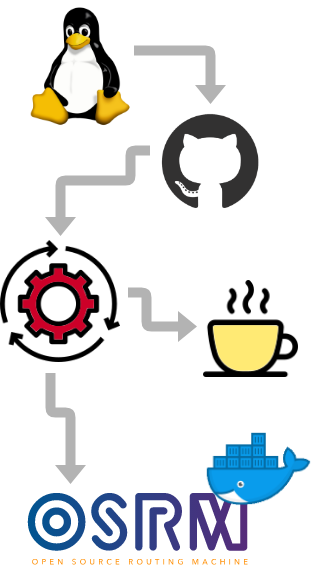
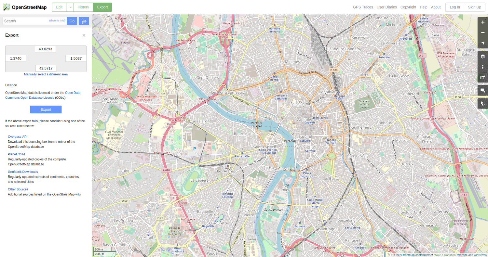
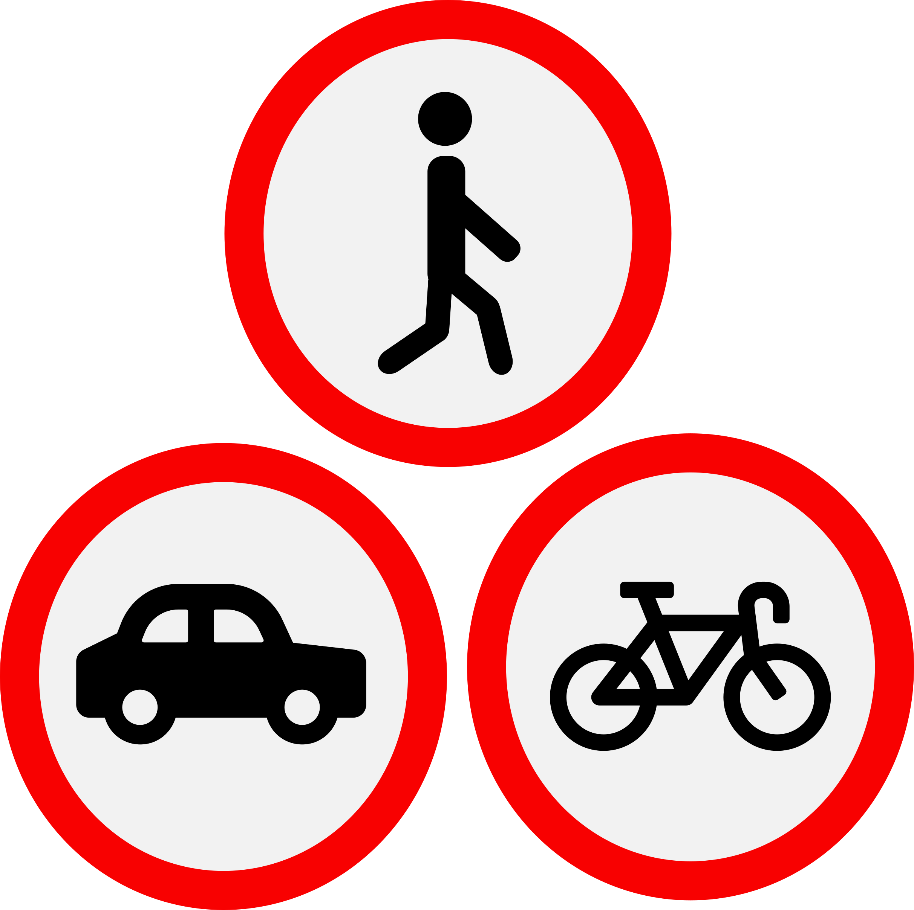
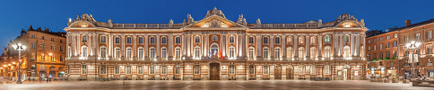
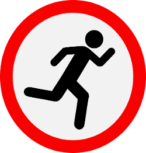
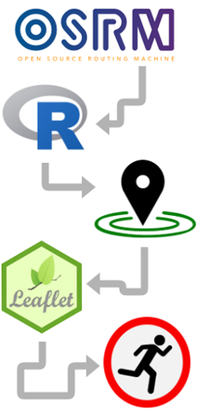
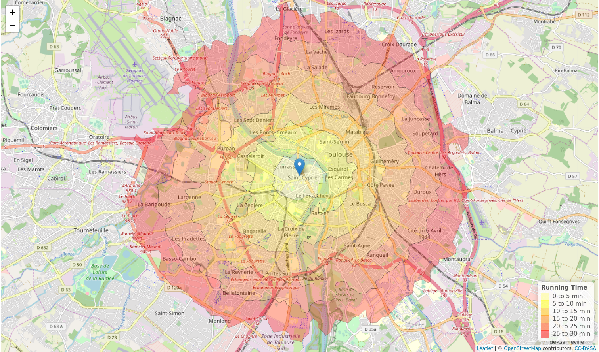

class: inverse, center, middle

# What can I see in Toulouse?
## Within different time intervals?
## With my running shoes on?

```{r setup, include=FALSE}
options(htmltools.dir.version = FALSE)
knitr::opts_chunk$set(echo = TRUE, warning=FALSE,  message=FALSE, fig.retina = 3)
```

---
class: center, middle


---
## Building OSRM
.left-column[

]
.right-column[
```{bash eval = FALSE}
# Necessary infrastructure. 
sudo apt update
sudo apt install -y git cmake build-essential jq htop \
                    liblua5.2-dev libboost-all-dev \
                    libprotobuf-dev libtbb-dev \
                    libstxxl-dev libbz2-dev

# Grab the source on GitHub.
git clone https://github.com/Project-OSRM/osrm-backend.git

# Create a build folder and then run cmake.
cd osrm-backend/
mkdir build
cd build/
cmake ..

# Next initiate the build. 
# This will take some time - grab a cup of coffee!
make

# When the build completes, 
# make the install target for OSRM.
sudo make install
```
]

---
## Getting the data - **www.openstreetmap.org**
<center></center>

---
## Preparing the data
.pull-left[
### Extract the map
- car
- bike
- foot

```{bash eval=FALSE}
osrm-extract map.xml -p profiles/foot.lua
```
]
.pull-right[

]
---
## Preparing the data
.pull-left[
### Extract the map
- car
- bike
- foot

```{bash eval=FALSE}
osrm-extract map.xml -p profiles/foot.lua
```

### Create the hierarchy

```{bash eval=FALSE}
osrm-contract map.xml.osrm
```

### Launch the service

```{bash eval=FALSE}
osrm-routed map.xml.osrm
```
]
.pull-right[

]
---
## How long and far to walk from here to the Capitole?
```{bash eval=FALSE}
curl "http://127.0.0.1:5000/route/v1/walking/1.434562,43.611834;1.443372,43.604478" | jq

{
  "code": "Ok",
  "waypoints": [
    {
      "hint": "rF0BgK5dAYCwAQAA3AAAAAAAAAAAAAAA_25wQu2E80EAAAAAAAAAALABAADcAAAAAAAAAAAAAAABAAAAxQ",
      "distance": 22.597897,
      "location": [
        1.43482,
        43.611913
      ],
      "name": "Esplanade Compans Caffarelli"
    },
    {
      "hint": "IxMAgNvgAIA9AQAAPQEAAAAAAAAAAAAA2VswQhh7L0IAAAAAAAAAAD0BAAA9AQAAAAAAAAAAAAABAAAAkg",
      "distance": 33.50137,
      "location": [
        1.442962,
        43.604431
      ],
      "name": "Place du Capitole"
    }
  ],
```
---
## How long and far to walk from here to the Capitole?
```{bash eval=FALSE}
"routes": [
    {
      "legs": [
        {
          "steps": [],
          "weight": 824.4,
          "distance": 1142.2,
          "summary": "",
          "duration": 824.4
        }
      ],
      "weight_name": "duration",
      "geometry": "m}diGsfwGp@]_@gBrCyA|@Ah@_@jHiCxAmA|AsErAyBjAsCvN_R?o@lAO",
      "weight": 824.4,
      "distance": 1142.2,
      "duration": 824.4
    }
  ]
}

```
.center[]
---
## The osrm R package

.pull-left[
```{r eval=FALSE}
install.packages('osrm')
```
]

.pull-right[
```{r echo=FALSE}
library(leaflet)
leaflet() %>% 
  setView(lng = 1.428678, lat = 43.598139, zoom = 14) %>% 
  addTiles() %>%
  addMarkers(lng = 1.428678, lat = 43.598139, popup = "My Airbnb")
```
]
---
## The osrm R package

.pull-left[
```{r eval=FALSE}
install.packages('osrm')
```

### **What can I see from my Airbnb with my running shoes on?**

*isochrone* = a line connecting points relating to the same travel time.
]

.pull-right[
```{r echo=FALSE}
leaflet() %>% 
  setView(lng = 1.428678, lat = 43.598139, zoom = 14) %>% 
  addTiles() %>%
  addMarkers(lng = 1.428678, lat = 43.598139, popup = "My Airbnb")
```
]
---
## The osrm R package

.pull-left[
```{r eval=FALSE}
install.packages('osrm')
```

### **What can I see from my Airbnb with my running shoes on?**

*isochrone* = a line connecting points relating to the same travel time.

.center[]
]

.pull-right[
```{r echo=FALSE}
leaflet() %>% 
  setView(lng = 1.428678, lat = 43.598139, zoom = 14) %>% 
  addTiles() %>%
  addMarkers(lng = 1.428678, lat = 43.598139, popup = "My Airbnb")
```
]
---
## Running time isochrones to explore Toulouse

.left-column[

]
.right-column[
```{r eval=FALSE}
# Libraries
library(osrm)
library(leaflet)
library(dplyr)

# Point to osrm server
options(osrm.server = "http://127.0.0.1:5000/")
 
# Set location
loc <- c(1.42, 43.59)

# Generate isochrones at time intervals
iso <- osrmIsochrone(loc, 
                     breaks = seq(from = 0, to = 30, by = 5), 
                     res = 400)

# Plot with Leaflet
leaflet(data = iso) %>% 
  setView(lng = 1.42, lat = 43.59, zoom = 13) %>%
  addTiles() %>% 
  addMarkers(lng = 1.42, lat = 43.59, popup = "My Airbnb") %>%
  addPolygons()
```
]

---
class: center, middle
<center></center>
---
class: center, middle

background-image: url("figs/background.png")

## So, who's coming at 6am tomorrow?!

## **@mbeckett_za**
## **megan@exegetic.biz**